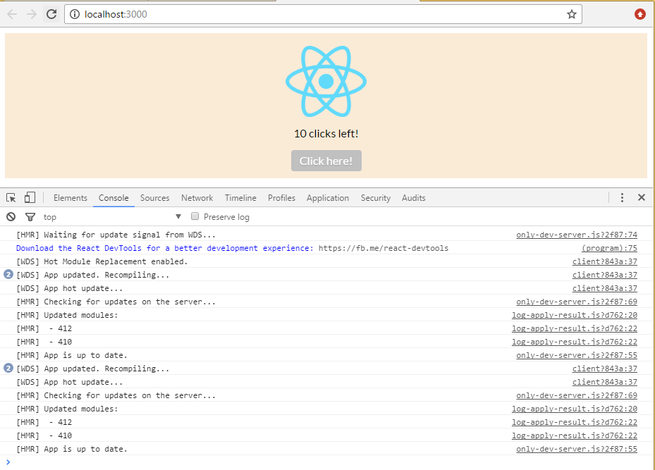

# Simple Starter Template for React, ES6, SASS, Webpack 2 and Live Reloading (React Hot Loader 3)
The reason for doing other React starter template for single page applications (SPA) 
is because when I started to look into templates it took to me hours and hours of googling and testing different templates
to have some starting point for my SPA application.   
There are templates with hundreds of dependencies. Why not reduce to the minimal needed to start playing with React?  
Let's try!


## Features
- [React](https://facebook.github.io/react) 
- [ES6](http://es6-features.org) (with [babel](https://babeljs.io))
- [SCSS](http://sass-lang.com) using ITCSS and [BEM](http://getbem.com/introduction/) methodology. 
    - See this [sample](https://github.com/xfiveco/chisel-sample/tree/master/src/styles)
- [Hot Module Replacement](https://medium.com/@dan_abramov/hot-reloading-in-react-1140438583bf#.xh6v0ht7j) ([React Hot Loader 3](https://github.com/gaearon/react-hot-loader/issues/243))
- Webpack 2
    - [Webpack-dev-server](https://webpack.js.org/how-to/develop/#webpack-dev-server)
    - Webpack Babel loader configuration
    - Webpack SCSS configuration
    - [Webpack configuration for HMR](https://webpack.js.org/how-to/hot-module-reload)
    - Webpack production configuration
         - Split out css files (two threads, JS and CSS) using [ExtractTextPlugin](https://github.com/webpack/extract-text-webpack-plugin) 
         - [UglifyJsPlugin with options](https://github.com/webpack/webpack/blob/v1.13.3/lib/optimize/UglifyJsPlugin.js)
         - Use include in the loader instead of the exclude. [More info](http://stackoverflow.com/questions/37823764/how-include-and-exclude-works-in-webpack-loader)
         - More perfomance tips: [here](https://medium.com/@khanght/optimize-webpack-production-build-ec594242b222#.bj3eyg65p)
    - Webpack stats (bundle optimization helper)
        - Generate stats.json file with profiler. Use (this tool)[http://webpack.github.io/analyse/] to analyze it.
        - [webpack visualizer](https://chrisbateman.github.io/webpack-visualizer/)
<br />

### Features NOT INCLUDED (TODOs)
- [React Router](https://css-tricks.com/learning-react-router)
- [Redux](https://css-tricks.com/learning-react-redux)
- Replace SASS with [PostCSS](http://postcss.org/)
- Testing. Integrate with [Jest](https://facebook.github.io/jest/)
- Linting. Integrate with [eslint](http://eslint.org/docs/user-guide/configuring)
- [Server Side Rendering](https://medium.com/@firasd/quick-start-tutorial-universal-react-with-server-side-rendering-76fe5363d6e#.s8k4bz7ki)


<br /><br />
## Getting Started
### Install pre-requisites
- Node.js and NPM: [Download and install](https://nodejs.org/). *I have version 6.6.0 of Node and 3.10.6 of NPM on Windows PC*
- Git: [Download and install](https://git-scm.com/). *I have version 2.7.4 installed on Windows PC*

### Clone Repo
1. Get the url of your forked project.
    - Go to https://github.com/username/react-es6-webpack-minimal-starter-template
2. Click on **"Clone or download"** and Copy to clipboard the url ending on .git.
3. Open your command line and go to your directoy  
*You don't need to create a specific folder for the project, it will be created by git*
4. Clone your forked repo on your machine:
```
$ git clone https://github.com/username/react-es6-webpack-minimal-starter-template
```  
*Note: That will create a new folder called react-es6-webpack-minimal-starter-template with all the files in.*

### Install yarn
We will use yarn as a client for NPM registry, because that will avoid some conflicts on dependencies between environments.  
Download and Install yarn (I have version 0.16.1 installed):
```
$ npm i -g yarn
```


### Install Project dependencies
As we have yarn, instead of using npm i to install all our dependencies in our node_modules folder, we will use just yarn.
*Note: you need to be sure your are inside the project folder because yarn will look for package.json file.*

```
$ cd react-es6-webpack-minimal-starter-template  
$ yarn
```


### Open the project with your Development IDE
I use VS Code https://code.visualstudio.com
Open the project using this command:
```
$ code .
``` 

### Start development server with Hot Reloading
```
$ npm run start
```

### Done! 
Now you can edit the files .jsx and .scss and see how the browser automatically reflects the changes.




<br /><br />

## Application Structure
Coming soon...


<br /><br />
## Contributing
Please feel free to add your own improvement. I am waiting your Pull Request (PR).

## License
MIT License
Copyright (c) 2016 Jose Quinto Zamora